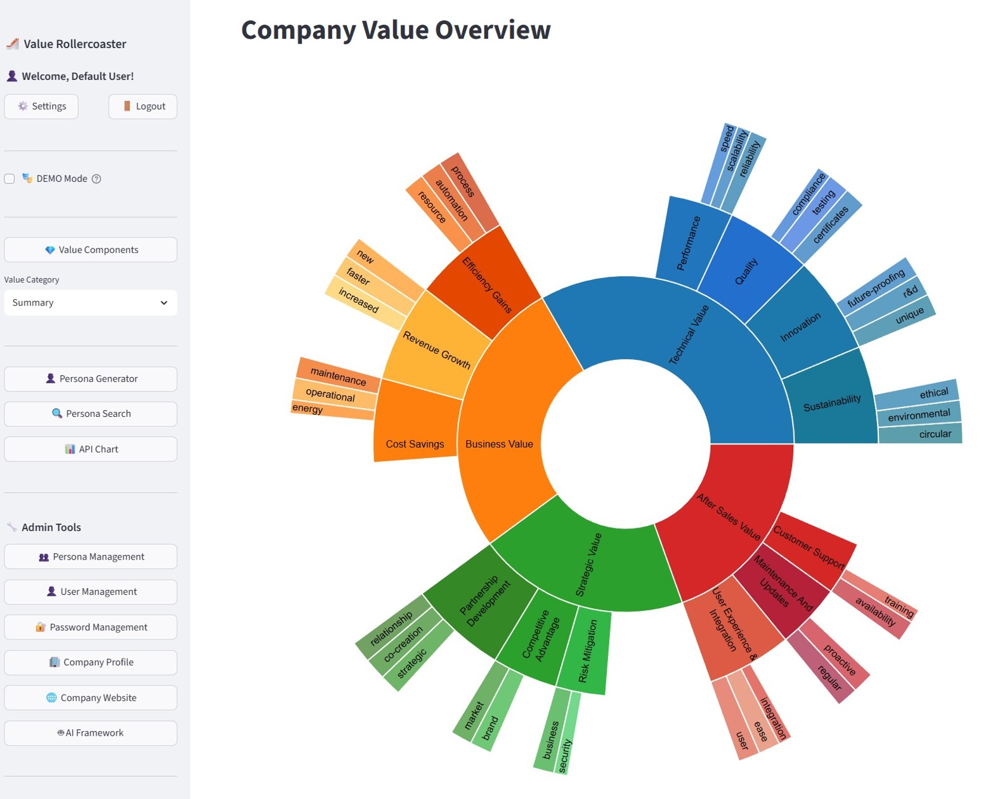

# 🎢 Value Rollercoaster

<div align="center">

**Transform company values into actionable tools that drive better customer conversations**

[](https://www.python.org/)
[](https://streamlit.io/)
[](LICENSE)
[](https://opensource.org/)

**Help your coworkers live company values through practical AI-powered value alignment**

[Quick Start](#-quick-start) • [Documentation](#-documentation) • [Features](#-key-features) • [Contributing](#-contributing)

</div>

---

## 📖 Table of Contents

- [What is Value Rollercoaster?](#-what-is-value-rollercoaster)
- [Organizational Benefits](#organizational-benefits)
- [Key Features](#-key-features)
- [Why Value Rollercoaster?](#-why-value-rollercoaster)
- [Quick Start](#-quick-start)
- [Documentation](#-documentation)
- [Contributing](#-contributing)
- [License](#-license)

---

## 🎯 What is Value Rollercoaster?

**Value Rollercoaster** is an open-source platform that helps organizations **let their coworkers live company values** by transforming values from inspiring principles into tangible, actionable tools used in daily work. Always having the customer in focus.

### The Problem It Solves

Most organizations have values—on the wall, in handbooks, on websites. But when you're working, talking to customers, or making decisions, **could those values help you see how your work creates customer value?**

Value Rollercoaster solves this through a core transformation process:
- **Individual perspectives** → Each employee interprets values from their role
- **AI transformation** → Converts diverse inputs into customer-focused benefits
- **Customer value visibility** → Everyone sees how their work creates customer value (customer benefit)
- **Practical applications** → Use transformed values for better customer conversations and prospect understanding

### 💼 Organizational Benefits

<table>
<tr>
<td width="50%">

### 🤝 Values Integration
Transform abstract company values into concrete, actionable tools that every team member can use daily. Values move from posters to practice, improving alignment across departments.

### 🤖 AI as Practical Support
Demonstrate to your organization that AI can genuinely support work—not replace it. Show employees how AI enhances their expertise, providing evidence-based insights while they maintain control and judgment.

</td>
<td width="50%">

### 👥 Everyone Contributes to Sales
Make it visible that every employee contributes to sales through their work. Customer support, technical teams, and account managers all see how their expertise connects to customer value—building a unified sales culture across the organization.

### 📈 Competitive Advantage
Stand out by showing prospects exactly how your values match their needs. The value alignment matrix provides clear evidence of fit, making your proposals more compelling and differentiated.

</td>
</tr>
</table>

### How It Works

#### The Core Transformation: From Individual Input to Customer Value

**This is the heart of Value Rollercoaster.** Every employee interprets company values differently—and that's a strength. The platform transforms these diverse perspectives into a unified understanding of customer value.

**The Core Process:**

1. **Individual Input**: Each employee fills in value components based on their role and perspective
   - Sales sees "Innovation" as new solutions for customers
   - R&D sees it as cutting-edge research  
   - IT sees it as technical excellence
   - Customer support sees it as better service tools

2. **AI Transformation**: Using your company's background (from admin settings) and **three AI models working together** (Google Gemini, OpenAI ChatGPT, and Perplexity Sonar), the platform transforms each input into **customer-focused benefits**

3. **Customer Value Visibility**: Every employee sees how their work creates value for customers—connecting their daily tasks to customer success

**Why This Matters:**

- **Everyone Contributes to Sales**: Even employees not directly in sales see how their work drives customer value and company success
- **Unified Customer Focus**: Different perspectives become a cohesive understanding of what customers need
- **Essential for Survival**: This alignment helps your company compete and succeed in the market

#### Practical Application: Persona Generation

Once your value components are defined (90% completion required), the platform uses them to analyze prospect websites and generate buyer personas. This demonstrates the practical power of your transformed values—showing exactly how your offerings match customer needs.

> **Note:** This is a helpful tool that supports your work—not a solution for everything. You still need your expertise, relationships, and judgment. This tool enhances your process but doesn't replace it.

### 📸 See It In Action

<div align="center">



*Company Value Overview showing the basic structure*

</div>

### 🏗️ Value Components Structure

> **Note on Structure**: The current 4-category framework (Technical, Business, Strategic, After Sales) reflects experience with large B2B production companies. **The structure is fully customizable**—you can modify categories, subcategories, and components to match your industry, company type, or business model. This flexibility is one of the benefits of open-source software.

The platform organizes your company values into a structured framework with **4 main categories**, each containing **subcategories** with specific components:

```
┌─────────────────────────────────────────────────────────────────────────┐
│                    Value Components Framework                            │
│                                                                           │
│  ┌──────────────────────────────────────────────────────────────────┐  │
│  │  🛠️ Technical Value                                               │  │
│  │  ┌──────────────┐  ┌──────────────┐  ┌──────────────┐          │  │
│  │  │   Quality     │  │ Performance  │  │  Innovation   │          │  │
│  │  │  • Certificates│  │  • Speed    │  │  • Unique     │          │  │
│  │  │  • Compliance │  │  • Reliability│  │    Features   │          │  │
│  │  │  • Testing    │  │  • Scalability│  │  • R&D        │          │  │
│  │  └──────────────┘  └──────────────┘  │  • Future-Proof│          │  │
│  │                                        └──────────────┘          │  │
│  │  ┌──────────────┐                                                │  │
│  │  │ Sustainability│                                                │  │
│  │  │  • Environment│                                                │  │
│  │  │  • Ethics     │                                                │  │
│  │  │  • Circular   │                                                │  │
│  │  └──────────────┘                                                │  │
│  └──────────────────────────────────────────────────────────────────┘  │
│                                                                           │
│  ┌──────────────────────────────────────────────────────────────────┐  │
│  │  💰 Business Value                                                 │  │
│  │  ┌──────────────┐  ┌──────────────┐  ┌──────────────┐            │  │
│  │  │ Cost Savings  │  │Revenue Growth│  │Efficiency Gains│          │  │
│  │  │  • Operational│  │  • Sales    │  │  • Process    │          │  │
│  │  │  • Maintenance│  │  • Markets   │  │  • Resources  │          │  │
│  │  │  • Energy     │  │  • Time-to- │  │  • Automation │          │  │
│  │  └──────────────┘  │    Market   │  └──────────────┘          │  │
│  │                     └──────────────┘                            │  │
│  └──────────────────────────────────────────────────────────────────┘  │
│                                                                           │
│  ┌──────────────────────────────────────────────────────────────────┐  │
│  │  🎯 Strategic Value                                                │  │
│  │  ┌──────────────┐  ┌──────────────┐  ┌──────────────┐          │  │
│  │  │ Competitive   │  │ Risk         │  │ Partnership  │          │  │
│  │  │ Advantage     │  │ Mitigation   │  │ Development  │          │  │
│  │  │  • Market     │  │  • Security  │  │  • Co-Creation│          │  │
│  │  │    Different. │  │  • Continuity│  │  • Roadmap    │          │  │
│  │  │  • Brand      │  └──────────────┘  │  • Relations  │          │  │
│  │  └──────────────┘                     └──────────────┘          │  │
│  └──────────────────────────────────────────────────────────────────┘  │
│                                                                           │
│  ┌──────────────────────────────────────────────────────────────────┐  │
│  │  🤝 After Sales Value                                              │  │
│  │  ┌──────────────┐  ┌──────────────┐  ┌──────────────┐            │  │
│  │  │ Customer      │  │ Maintenance │  │ User Exp. & │            │  │
│  │  │ Support      │  │ & Updates   │  │ Integration  │            │  │
│  │  │  • Availability│  │  • Updates │  │  • Ease of   │            │  │
│  │  │  • Training   │  │  • Proactive│  │    Use       │            │  │
│  │  └──────────────┘  └──────────────┘  │  • Integration│            │  │
│  │                                        │  • Adoption  │            │  │
│  │                                        └──────────────┘            │  │
│  └──────────────────────────────────────────────────────────────────┘  │
└─────────────────────────────────────────────────────────────────────────┘
```

**How It Works:**
- **Define Components**: Each employee fills in value components based on their role and perspective
- **AI Transformation**: AI automatically transforms your inputs into customer-focused benefits using your company's background context
- **See Customer Value**: Every employee sees how their work creates value for customers
- **Customize Importance**: Adjust weights and ratings to reflect your priorities
- **90% Completion Required**: For using transformed values in practical applications like persona generation
- **Match with Prospects**: Once transformed, these customer-focused components are matched against prospect needs during persona generation

### 🔄 Complete Workflow

The platform transforms a prospect's website into actionable insights through a complete setup and analysis process:

```
┌─────────────────────────────────────────────────────────────┐
│              Phase 1: Admin Setup (One-Time)                 │
│  ┌──────────────┐  ┌──────────────┐  ┌──────────────┐     │
│  │   Company    │  │      AI       │  │   Company     │     │
│  │   Profile     │  │  Framework    │  │   Website     │     │
│  │  (Business,   │  │  (Adjust if   │  │  (URL &       │     │
│  │   Market,     │  │   needed)     │  │   Scrape)     │     │
│  │   Branding)   │  │               │  │               │     │
│  └──────────────┘  └──────────────┘  └──────────────┘     │
└──────────────────────┬──────────────────────────────────────┘
                       │
┌──────────────────────▼──────────────────────────────────────┐
│         Phase 2: Value Components Setup (All Users)          │
│  ┌──────────────┐  ┌──────────────┐  ┌──────────────┐     │
│  │  Technical   │  │   Business    │  │  Strategic   │     │
│  │    Value     │  │    Value      │  │    Value     │     │
│  │              │  │               │  │              │     │
│  └──────────────┘  └──────────────┘  └──────────────┘     │
│  ┌──────────────┐                                          │
│  │ After Sales  │  • Each employee fills components        │
│  │    Value     │  • AI transforms to customer benefits   │
│  └──────────────┘  • Everyone sees their value contribution│
│                    • Adjust importance & save             │
│                                                             │
└──────────────────────┬──────────────────────────────────────┘
                       │
┌──────────────────────▼──────────────────────────────────────┐
│              Phase 3: Persona Generation Input               │
│  ┌──────────────┐              ┌──────────────┐            │
│  │   Website    │              │    Value     │            │
│  │     URL      │              │  Components │            │
│  │  (Prospect)  │              │   (Saved)   │            │
│  └──────────────┘              └──────────────┘            │
└──────────────────────┬──────────────────────────────────────┘
                       │
┌──────────────────────▼──────────────────────────────────────┐
│              Step 1-2: AI Analysis Layer                     │
│  ┌──────────────┐  ┌──────────────┐  ┌──────────────┐     │
│  │   Google     │  │   OpenAI     │  │    Sonar     │     │
│  │   Gemini     │  │   ChatGPT    │  │  Validation  │     │
│  │  (Analysis)  │  │  (Insights)  │  │  (Quality)   │     │
│  └──────────────┘  └──────────────┘  └──────────────┘     │
└──────────────────────┬──────────────────────────────────────┘
                       │
┌──────────────────────▼──────────────────────────────────────┐
│         Step 3: Market Intelligence Layer                    │
│  ┌──────────────┐              ┌──────────────┐            │
│  │   Eurostat   │              │    Web       │            │
│  │     API      │              │   Search     │            │
│  └──────────────┘              └──────────────┘            │
└──────────────────────┬──────────────────────────────────────┘
                       │
┌──────────────────────▼──────────────────────────────────────┐
│         Step 4: Value Alignment Workflow                     │
│  ┌──────────────┐  ┌──────────────┐  ┌──────────────┐     │
│  │   Profiler   │  │ Hypothesizer │  │    Final     │     │
│  │    Agent     │  │    Agent     │  │   Aligner    │     │
│  └──────────────┘  └──────────────┘  └──────────────┘     │
└──────────────────────┬──────────────────────────────────────┘
                       │
┌──────────────────────▼──────────────────────────────────────┐
│         Step 5-7: Persona Synthesis & QA                     │
│  ┌──────────────┐              ┌──────────────┐            │
│  │   Creative   │              │   Quality     │            │
│  │   Elements   │              │  Assurance    │            │
│  │  Generation  │              │  (9 Gates)   │            │
│  └──────────────┘              └──────────────┘            │
└──────────────────────┬──────────────────────────────────────┘
                       │
┌──────────────────────▼──────────────────────────────────────┐
│                    Output Layer                              │
│  ┌──────────────┐  ┌──────────────┐  ┌──────────────┐     │
│  │    Buyer     │  │    Value     │  │  Evidence-   │     │
│  │   Persona    │  │  Alignment   │  │   Based      │     │
│  │  (Insights)  │  │   Matrix     │  │ Recommendations│   │
│  └──────────────┘  └──────────────┘  └──────────────┘     │
└─────────────────────────────────────────────────────────────┘
```

**Workflow Phases:**
- **Phase 1 (Admin)**: Company Profile → AI Framework → Company Website setup
- **Phase 2 (All Users)**: Each employee defines value components from their perspective → AI transforms to customer benefits → Everyone sees their value contribution → Adjust importance → Save
- **Phase 3-7**: Persona generation with 7-step AI analysis and 9 quality checkpoints

---

## ✨ Key Features

<table>
<tr>
<td width="50%">

### 🎯 Value Components System
Define your organization's values across 4 categories (Technical, Business, Strategic, After Sales). Each employee interprets values from their role, and AI transforms these diverse perspectives into unified customer-focused benefits—making everyone see how their work creates customer value.

### 🤖 AI-Powered Persona Generation
Analyze prospect websites and match them with your values. Generate comprehensive buyer personas in 5-8 minutes with evidence-based insights.

</td>
<td width="50%">

### 📊 Value Alignment Matrix
See exactly how your values match prospect needs with match scores and evidence. Visualize alignment opportunities at a glance.

### ✅ Quality Gates
9 validation checkpoints prevent hallucinations and ensure accuracy. Get confidence scores and evidence for every insight.

</td>
</tr>
</table>

### Additional Benefits

- 🔓 **Open Source**: Full source code access, customizable, no licensing fees
- 💰 **Low Cost**: Only API token costs, no expensive enterprise licenses
- 🔒 **Secure**: Deploy on your infrastructure with full control
- 🎨 **Customizable**: Adapt to your organization's specific needs
  - **Value Structure**: The 4-category framework is based on large B2B production company experience, but you can modify categories, subcategories, and components to match your industry or business model
  - **Full Flexibility**: Change the structure in `app/categories.py` to reflect your organization's unique value framework

---

## 💡 Why Value Rollercoaster?

### Your Values, Your Way

**Every team member interprets company values differently**, and that's a strength:
- Sales sees "Innovation" as new solutions for customers
- R&D sees it as cutting-edge research
- IT sees it as technical excellence

This diversity makes values richer and more applicable. Value Rollercoaster helps you see these different interpretations and use them effectively.

### Everyone is Selling

You might not think of yourself as a salesperson, but **every customer interaction is a sales moment**:
- Customer support resolving issues → selling trust and reliability
- Technical teams explaining features → selling expertise and innovation
- Account managers building relationships → selling partnership and value

This platform helps you recognize and leverage these moments.

### AI as Creative Support

**Three AI models with quality gates** demonstrate practical, safe AI usage:
- **Google Gemini**: Structured analysis and data validation
- **OpenAI ChatGPT**: Creative insights and alternative perspectives
- **Sonar (Perplexity)**: Quality validation to prevent hallucinations

**9 quality checkpoints** throughout the process ensure accuracy and reliability—not generic outputs, but evidence-based insights.

> 💭 **Want to understand the story behind Value Rollercoaster?** Read about [the personal perspective, motivations, and philosophy](docs/PHILOSOPHY.md) that inspired this project—from making values actionable tools to demonstrating practical AI usage.

---

## 🚀 Quick Start

### Prerequisites

- **Python 3.8+**
- **API Keys**:
  - Google Gemini API key (required)
  - OpenAI API key (required)
  - Perplexity Sonar API key (required)
- **Qdrant Database**: Cloud or local instance
- **Ollama**: For local embeddings (optional - can be changed to API)

### Installation

```bash
# Clone the repository
git clone https://github.com/ValueRollerCoaster/ValueRollerCoaster.git
cd ValueRollerCoaster

# Install dependencies
pip install -r requirements.txt

# Set up environment variables
cp .env.example .env
# Edit .env with your API keys

# Run the application
streamlit run app.py
```

### First Steps

1. **Configure your company** (admin setup - one-time)
2. **Define value components** - Each employee fills in components from their perspective
3. **See customer benefits** - AI transforms your inputs into customer-focused value
4. **Use transformed values** - Generate personas, align with prospects, have better conversations

> 📚 **For detailed setup instructions, see [Deployment Guide](docs/FOR%20IT%20DEPARTMENT/DEPLOYMENT_GUIDE.md)**

---

## 📚 Documentation

### For Your Department

Choose the guide that fits your role:

#### 👑 [For Executive Leadership](docs/FOR%20EXECUTIVE%20LEADERSHIP/FOR_EXECUTIVE_LEADERSHIP.md)
- **Quick Introduction**: [FOR_EXECUTIVE_LEADERSHIP.md](docs/FOR%20EXECUTIVE%20LEADERSHIP/FOR_EXECUTIVE_LEADERSHIP.md)

**Focus**: Transform company values into competitive advantages. Maximize ROI on existing investments, enable organizational alignment, and position your organization for competitive success.

#### 👔 [For Sales Teams](docs/FOR%20SALES%20DEPARTMENT/FOR_SALES_TEAMS.md)
- **Quick Introduction**: [FOR_SALES_TEAMS.md](docs/FOR%20SALES%20DEPARTMENT/FOR_SALES_TEAMS.md)
- **Complete Guide**: [SALES_COMPLETE_GUIDE.md](docs/FOR%20SALES%20DEPARTMENT/SALES_COMPLETE_GUIDE.md)

**Focus**: Living company values through sales conversations. This is a helpful tool that supports your work—not a replacement for your sales skills.

#### 👥 [For HR Teams](docs/FOR%20HR%20DEPARTMENT/FOR_HR_TEAMS.md)
- **Quick Introduction**: [FOR_HR_TEAMS.md](docs/FOR%20HR%20DEPARTMENT/FOR_HR_TEAMS.md)
- **Complete Guide**: [HR_COMPLETE_GUIDE.md](docs/FOR%20HR%20DEPARTMENT/HR_COMPLETE_GUIDE.md)

**Focus**: Helping coworkers live company values through internal integration. **Not for recruitment**—for helping employees understand and apply company values.

#### 💻 [For IT Teams](docs/FOR%20IT%20DEPARTMENT/FOR_IT_TEAMS.md)
- **Quick Introduction**: [FOR_IT_TEAMS.md](docs/FOR%20IT%20DEPARTMENT/FOR_IT_TEAMS.md)
- **Technical Documentation**: [README_TECHNICAL.md](docs/FOR%20IT%20DEPARTMENT/README_TECHNICAL.md)

**Focus**: Enabling coworkers to live values through technology. **Open source, low cost** (only API tokens), demonstrates IT as value-adding department.

### Technical & Deployment

- **[Deployment Guide](docs/FOR%20IT%20DEPARTMENT/DEPLOYMENT_GUIDE.md)**: Complete deployment instructions for all scenarios
- **[Technical Documentation](docs/FOR%20IT%20DEPARTMENT/README_TECHNICAL.md)**: System architecture, API documentation, development guide

### Additional Resources

- **[Persona Generation Prompts](docs/Usage/ALL_PERSONA_GENERATION_PROMPTS.md)**: All prompts used in persona generation
- **[Admin Guide](docs/Usage/Admin/ADMIN_GUIDE.md)**: Administrator guide
- **[Token Limits Guide](docs/FOR%20IT%20DEPARTMENT/TOKEN_LIMITS_GUIDE.md)**: Understanding API usage and costs
- **[Philosophy & Vision](docs/PHILOSOPHY.md)**: The story behind Value Rollercoaster

---

## 🤝 Contributing

We welcome contributions! Please see our [Contributing Guide](CONTRIBUTING.md) for details on:

- Code of Conduct
- How to contribute
- Development setup
- Pull request process
- Coding standards

**First time contributing?** Check out our [good first issues](https://github.com/ValueRollerCoaster/ValueRollerCoaster/labels/good%20first%20issue) to get started.

---

## 📄 License

This project is licensed under the MIT License - see the [LICENSE](LICENSE) file for details.

---

## 🙏 Acknowledgments

- Built with [Streamlit](https://streamlit.io/)
- Powered by Google Gemini, OpenAI ChatGPT, and Perplexity Sonar
- Vector database powered by [Qdrant](https://qdrant.tech/)
- Co-created with [Cursor](https://cursor.com/) AI assistance

---

<div align="center">

**Help your coworkers live company values through practical AI-powered value alignment**

[⬆ Back to Top](#-value-rollercoaster)

Made with ❤️ by RS

</div>
